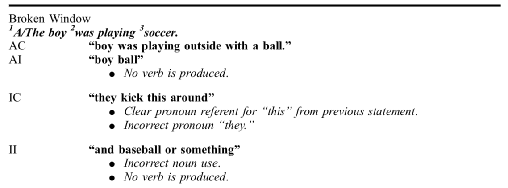

# **Scoring Examples** {#scoring-examples}

****

Taken from Appendix 4 of:

Richardson, J. D., &amp; Dalton, S. G. (2016). Main concepts for three different discourse tasks in a large non-clinical sample. _Aphasiology_, _30_(1), 45-73.

​​

| Cat in the Tree |
| --- |
| **1_The little girl_ 2_was riding_ 3_her bicycle_**.**** |
| AC | **“Sally was pedaling her bike around.”** |
| AI | **“little girl… bike.”** |
| IC | **“He was riding a tricycle.”** |
| II | **“little boy… dirt bike.”** |
|  |
| Refused Umbrella |
| **1_The boy_ 2_walks_ 3_to school_.** |
| AC | **“Timmy headed out to school.”** |
| AI | **“and he goes”** |
| IC | **“so she goes outside.”** |
| II | **“she runs.”** |

Taken from Appendix 3 of:

Richardson, J. D., &amp; Dalton, S. G. (2019). Main concepts for two picture description tasks: an addition to Richardson and Dalton, 2016\. _Aphasiology_.